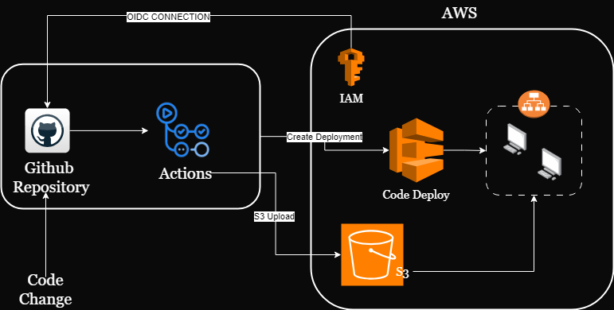
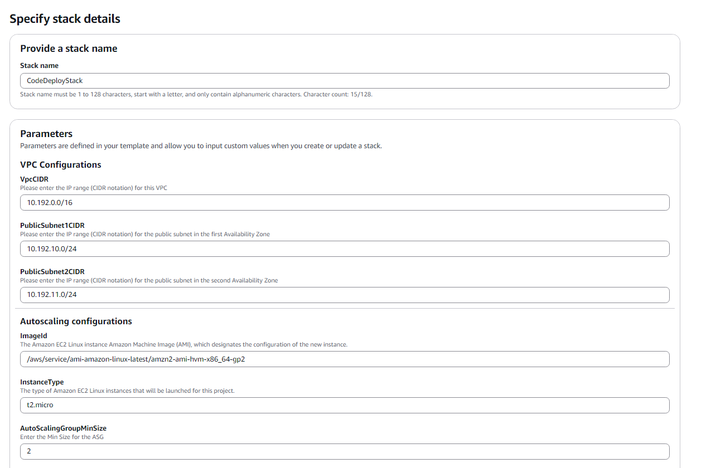
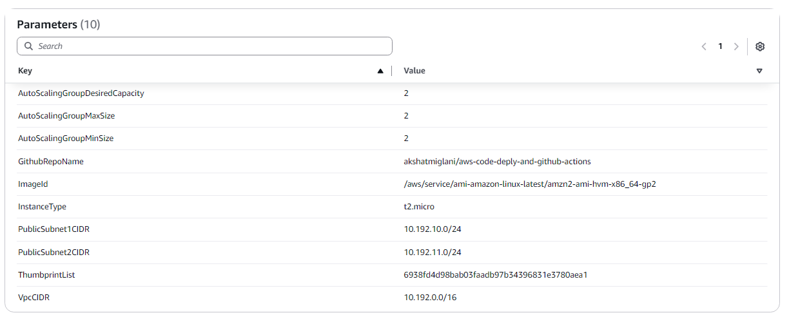
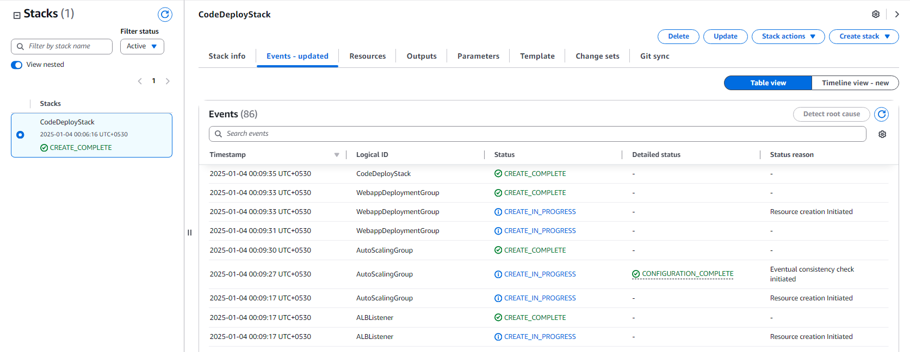
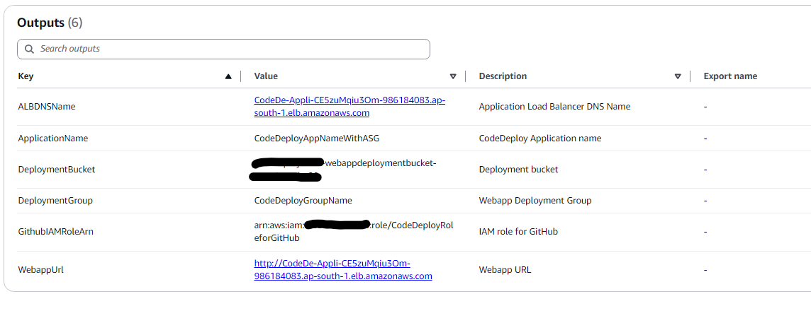
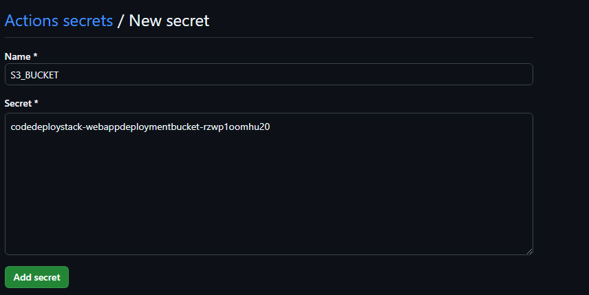
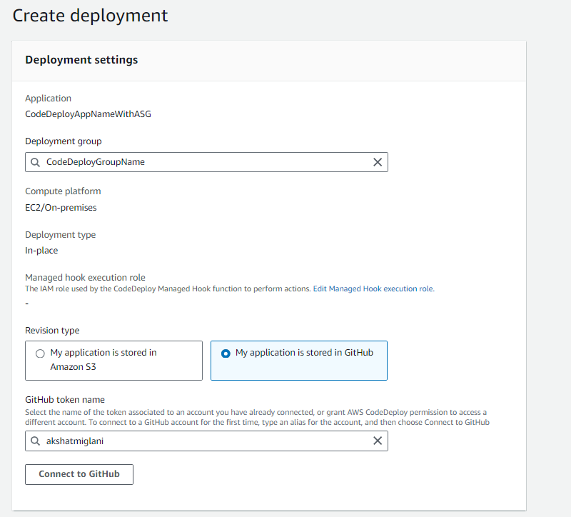

# Automated Deployment Pipeline with GitHub Actions and AWS CodeDeploy

## Introduction
This project sets up an automated deployment pipeline that integrates GitHub Actions and AWS CodeDeploy. The goal is to automate the deployment of a React application to AWS infrastructure, enabling a seamless continuous delivery pipeline. The application is automatically deployed to AWS resources, ensuring secure, scalable, and efficient delivery to production.

## Overview of Project

## Steps
### Creating Required Resources using Cloud Formation Tempalates

This step involves using AWS CloudFormation templates to create the necessary AWS resources. These resources will host, secure, and deploy the React application.

- Amazon EC2 Linux Instances with CodeDeploy Agent

- Auto Scaling Group with Internet Application Load Balancer

- CodeDeploy Application and Deployment Group

- Amazon S3 Bucket

- IAM OIDC Identity Provider

- EC2 Instance Profile

- Service Role for CodeDeploy

- Security Groups for EC2 and ALB

Outputs which will be required for the project:

###  Configuring Github Actions Secrets

GitHub Actions requires secret keys and configurations to securely interact with AWS services. You'll need to configure the following GitHub secrets:

- S3 Bucket Name: The name of the S3 bucket where build artifacts will be uploaded.

- IAM Role: The IAM role assumed by GitHub Actions to access AWS resources.

Do the same for IAMROLE_GITHUB.

### Autohorizing Github and AWS Code Deploy

It is required to create a conneciton between AWS Code Deploy and Github.

Navigate to AWS Code Deploy -> Applications page

Click on create a new Deployment and for revision-type select My application is stored in Github and connect to Github.

For more details follow the below link:
https://docs.aws.amazon.com/codedeploy/latest/userguide/integrations-partners-github.html#behaviors-authentication

###  Creating a Github Actions Workflow with Build and Deploy Steps

The GitHub Actions workflow automates the process of building and deploying the React application. It consists of two main steps:

Build Step:
- Assume GitHub IAM Role: The GitHub Action assumes an IAM role with sufficient permissions to access AWS resources securely.

- Build the React Application: The action installs the dependencies and runs the build process using npm run build.

- Upload Build Artifacts to S3: After the build is complete, the resulting artifacts (e.g., dist/ folder) are zipped and uploaded to an S3 bucket to be used for deployment.

Deploy Step:
- Assume GitHub IAM Role: The deploy step also assumes the same IAM role to securely interact with AWS.

- Deploy using CodeDeploy: AWS CodeDeploy is triggered, and the application is deployed to the EC2 instances using the artifacts stored in S3.

### Creating the AppSpec File and Related Scripts

The AppSpec file (appspec.yml) defines the deployment process and specifies the location of the build folder as well as scripts for various deployment hooks.

This file is critical for AWS CodeDeploy to know which files to deploy, where to deploy them, and which hooks to run during the deployment lifecycle. It includes the following:

- Source and Destination Paths: Specifies the source folder (e.g., dist/ from the build) and the destination folder on the EC2 instances (e.g., /var/www/html).

- Hooks: Defines deployment hooks that allow for custom actions before, during, and after deployment. This includes:

- AfterInstall: Installs necessary software (e.g., Apache) and sets file permissions.

- ApplicationStart: Starts the application server (e.g., Apache HTTP Server).

Scripts:
- after_install.sh: This script is executed after CodeDeploy copies the files to the target EC2 instances. It installs required software (e.g., httpd), changes ownership and permissions, and prepares the environment for the app.

- start_server.sh: This script starts the web server (e.g., Apache) that serves the React application.

###  Triggering the workflow & Observing the Results

Once the pipeline runs, you can monitor the progress and status of the deployment directly through the GitHub Actions interface and AWS CodeDeploy Console. You will see logs related to the build process, deployment process, and any errors that may occur.

On the Code Deploy Console you should see 'Succeeded'.

Access the application from the WebAppUrl from the Cloud Formation Template:

## Explanation of Concepts

1. AWS Code Deploy

AWS CodeDeploy is a fully managed deployment service that automates software deployments to a variety of compute services, including Amazon EC2, AWS Lambda, and on-premises instances. In this project, CodeDeploy is used to deploy the React application to EC2 instances by fetching the build artifacts from S3.

Deployment Group: A set of EC2 instances managed by CodeDeploy, which will receive the deployment.

AppSpec File: Specifies the deployment instructions for CodeDeploy, including which files to deploy, where to deploy them, and which lifecycle hooks to run.

2. Github Actions

GitHub Actions is a powerful CI/CD platform that automates workflows in response to various events in your GitHub repository. In this project, GitHub Actions is used to automate the build and deployment pipeline. It allows us to:

Build the React Application: Run build commands (e.g., npm run build) and create the necessary artifacts for deployment.

Upload Artifacts to S3: Automatically upload the build artifacts to an S3 bucket, making them available for deployment.

Trigger AWS CodeDeploy: Use AWS CLI commands within the GitHub Actions workflow to trigger CodeDeploy and deploy the artifacts to EC2 instances.
